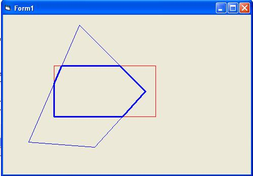



## Sutherland Hodgman Polygon Clipper

### Description

This code clip a polygon with Sutherland-Hodgman Algorithm .
 
### More Info
 
Polygon (poly) array and Clipper edge array (ed) .

Array of Clipped polygon (Res) .

             |
---                |---
**Submitted On**   |2006-12-05 08:30:02
**By**             |[Hamed Sheidaian](https://github.com/Planet-Source-Code/PSCIndex/blob/master/ByAuthor/hamed-sheidaian.md)
**Level**          |Advanced
**User Rating**    |4.0 (8 globes from 2 users)
**Compatibility**  |VB 6\.0
**Category**       |[Graphics](https://github.com/Planet-Source-Code/PSCIndex/blob/master/ByCategory/graphics__1-46.md)
**World**          |[Visual Basic](https://github.com/Planet-Source-Code/PSCIndex/blob/master/ByWorld/visual-basic.md)
**Archive File**   |[Sutherland2035571252006\.zip](https://github.com/Planet-Source-Code/hamed-sheidaian-sutherland-hodgman-polygon-clipper__1-67293/archive/master.zip)

